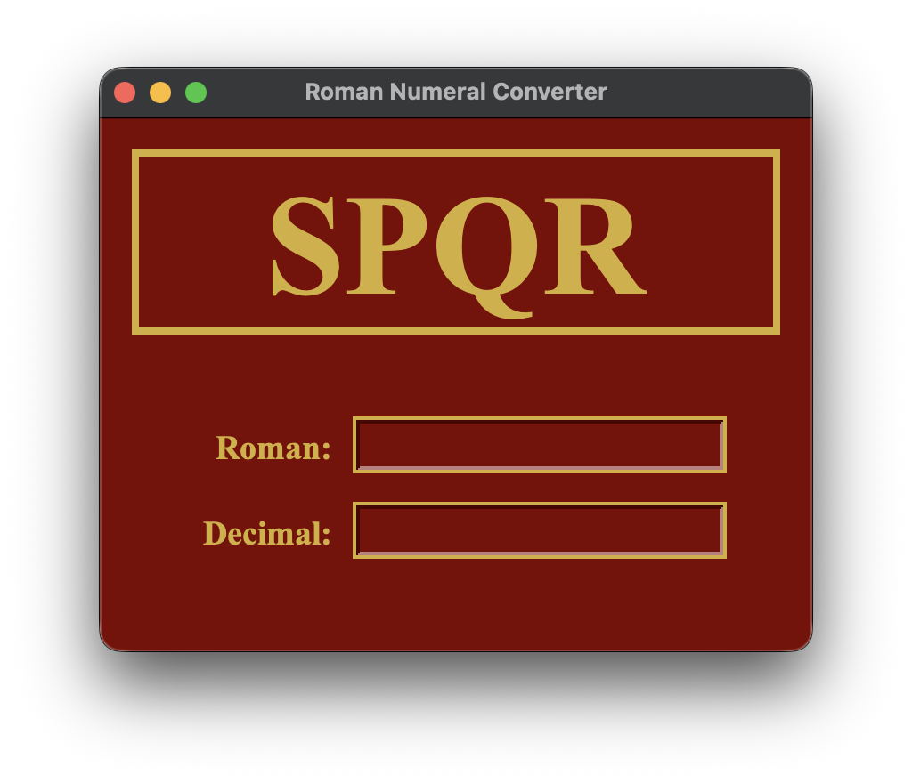

# Roman Numeral Converter

A simple Python desktop app to convert between **Roman numerals** and **decimal numbers**. Built with Tkinter.



---

## Features

* Convert Roman → Decimal and Decimal → Roman
* Works only in the valid range (1–3999)
* Shows clear messages for invalid input
* Clean Roman Flag Theme UI with SPQR banner and Roman colors

---

## How to Run

### Requirements

* Python 3.8+
* Tkinter (usually included with Python)

### Steps

```bash
# Run the app
python main.py
```

On Linux, if Tkinter is missing:

```bash
sudo apt-get install python3-tk   # Debian/Ubuntu
sudo dnf install python3-tkinter  # Fedora
sudo pacman -S tk                 # Arch
```

---

## Project Files

* `converter.py` – Conversion functions
* `gui.py` – Tkinter interface
* `main.py` – App entry point

---

## Examples

```python
from converter import int_to_roman, roman_to_int

print(int_to_roman(42))   # XLII
print(roman_to_int("MCM"))  # 1900
```
